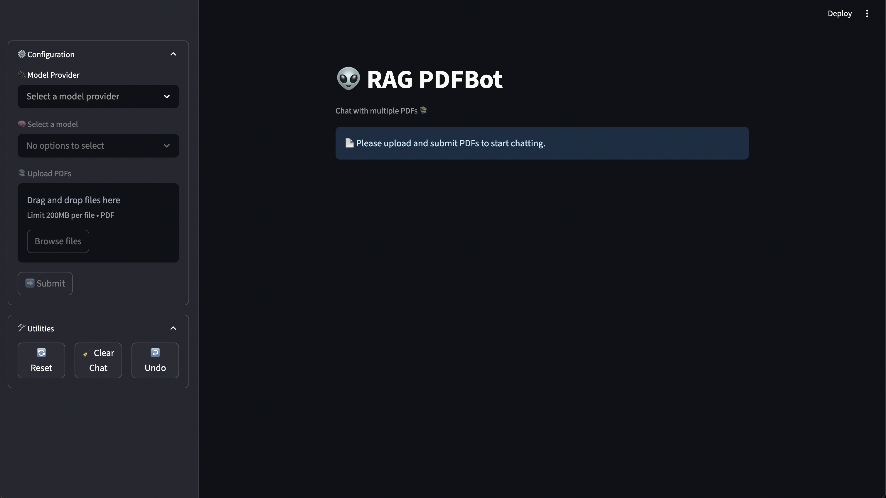
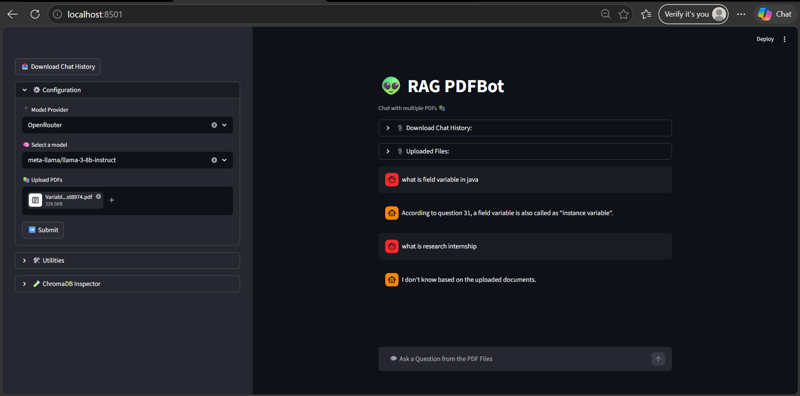
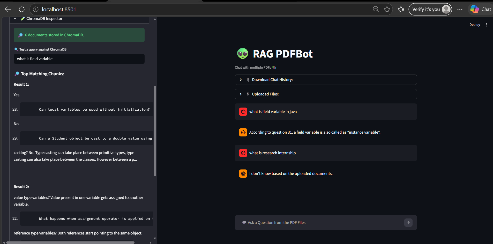

# 👽 RAG PDFBot – Intelligent Multi-PDF Question Answering System

## 📌 Overview

RAG PDFBot is a Retrieval-Augmented Generation (RAG) application that enables users to interact with multiple PDF documents using natural language questions.

Instead of manually searching through lengthy documents, users can upload one or more PDFs and ask questions in a conversational manner. The system retrieves the most relevant information from the uploaded documents and generates context-aware answers using Large Language Models (LLMs).

This project demonstrates the practical implementation of modern AI technologies including document processing, semantic search, vector databases, retrieval pipelines, and LLM integration.

---

## 🎯 Problem Statement

Organizations and individuals often work with large collections of documents where finding specific information can be time-consuming and inefficient.

Traditional keyword search struggles with:

* Semantic understanding
* Natural language questions
* Context-based retrieval
* Information spread across multiple documents

This project solves these challenges by combining semantic retrieval with Large Language Models, allowing users to query documents naturally and receive accurate answers grounded in the uploaded content.

---

## 🚀 Key Features

### 📚 Multi-PDF Support

Upload and process multiple PDF files simultaneously.

### 🔎 Semantic Search

Uses embeddings and vector similarity search to find relevant information even when exact keywords are not present.

### 🤖 LLM-Powered Responses

Generates contextual answers using:

* OpenRouter Models
* Groq Models

### 🧠 Retrieval-Augmented Generation (RAG)

Answers are generated only from retrieved document content rather than relying solely on model knowledge.

### 📂 ChromaDB Vector Storage

Stores document embeddings efficiently for fast retrieval.

### 💬 Interactive Chat Interface

User-friendly Streamlit chat interface.

### 📥 Download Chat History

Export complete conversation history as CSV.

### 🧪 Developer Mode

Built-in ChromaDB inspector for testing retrieval quality and viewing matching chunks.

### 🔄 Dynamic Model Switching

Switch between providers without restarting the application.

### 🛠 Session Management

Supports reset, clear chat, and undo functionality.

---

## 🏗️ System Architecture

```
User Query
│
▼
Streamlit Interface
│
▼
Uploaded PDF Files
│
▼
Text Extraction (PyPDF)
│
▼
Text Chunking
│
▼
Embeddings Generation
│
▼
ChromaDB Vector Store
│
▼
Retriever
│
▼
Relevant Chunks
│
▼
LLM (Groq / OpenRouter)
│
▼
Generated Answer
```

---

## ⚙️ Technology Stack

| Component       | Technology                        |
| --------------- | --------------------------------- |
| Frontend        | Streamlit                         |
| LLM Integration | LangChain                         |
| LLM Providers   | OpenRouter, Groq                  |
| Vector Database | ChromaDB                          |
| Embeddings      | HuggingFace Sentence Transformers |
| PDF Processing  | PyPDF                             |
| Text Chunking   | RecursiveCharacterTextSplitter    |
| Language        | Python                            |

---

## 📁 Project Structure

```
RAG-BOT-CHROMA-MAIN
│
├── app.py
│
├── utils/
│   ├── chat_handler.py
│   ├── sidebar_handler.py
│   ├── llm_handler.py
│   ├── vectorstore_handler.py
│   ├── pdf_handler.py
│   ├── developer_mode.py
│   └── config.py
│
├── data/
│   ├── groq_vector_store.chroma
│   └── openrouter_vector_store.chroma
│
├── assets/
│
├── .env
├── requirements.txt
└── README.md
```

---

## 🔍 How It Works

### Step 1: Upload PDFs

Users upload one or more PDF documents through the Streamlit interface.

### Step 2: Text Extraction

The application extracts text from all uploaded PDFs using PyPDF.

### Step 3: Chunk Creation

Large documents are split into manageable overlapping chunks using RecursiveCharacterTextSplitter.

### Step 4: Embedding Generation

Each chunk is converted into vector embeddings using HuggingFace Sentence Transformer models.

### Step 5: Vector Storage

Embeddings are stored in ChromaDB for efficient semantic retrieval.

### Step 6: Retrieval

When a user asks a question, the retriever fetches the most relevant document chunks.

### Step 7: Response Generation

Retrieved chunks are passed to the selected LLM, which generates a context-aware answer.

---

## 💡 Engineering Challenge

### Challenge

One of the major challenges was ensuring that the LLM answered strictly from the uploaded documents instead of generating responses using its own pre-trained knowledge.

Without proper controls, the model could produce hallucinated answers that were not present in the PDF content.

### Solution

A custom Retrieval-Augmented Generation pipeline was implemented using LangChain Retrieval Chains.

The prompt explicitly instructs the model to:

* Use only retrieved document context
* Avoid guessing
* Return a fallback response when information is unavailable

Fallback Response:

```
I don't know based on the uploaded documents.
```

This significantly improved answer reliability and reduced hallucinations.

---

## 📸 Application Screenshots

### Main Interface



### PDF Upload & Chat



### ChromaDB Inspector



## 🎥 Demo Video

[▶ Watch Demo Video](https://drive.google.com/file/d/1_HgOAPc_oUs_1wWRitCW__gSTQAhqYwO/view?usp=sharing)

## 🔐 Environment Variables

Create a `.env` file in the project root:

```env
GROQ_API_KEY=your_groq_api_key
OPENROUTER_API_KEY=your_openrouter_api_key
```

---

## 📦 Installation

Clone the repository:

```bash
git clone https://github.com/Aashritha-MB/RAG-pdfbot.git

cd RAG-pdfbot
```

Create a virtual environment:

```bash
python -m venv .venv
```

Activate virtual environment:

### Windows

```bash
.venv\Scripts\activate
```

### Linux / macOS

```bash
source .venv/bin/activate
```

Install dependencies:

```bash
pip install -r requirements.txt
```

---

## ▶️ Running the Application

```bash
streamlit run app.py
```

Open your browser and navigate to:

```text
http://localhost:8501
```

---

## 🧪 Developer Utilities

The application includes a built-in ChromaDB Inspector that allows developers to:

* View indexed document count
* Test similarity search queries
* Inspect retrieved chunks
* Validate embedding quality

This helps during debugging and retrieval optimization.

---

## 📊 Future Improvements

* Source citations with page references
* Hybrid Search (BM25 + Vector Search)
* Cross-Encoder Re-ranking
* DOCX and PPT document support
* Conversational memory
* User authentication and access control
* Cloud deployment (AWS/Azure/GCP)
* Streaming responses from LLMs

---


